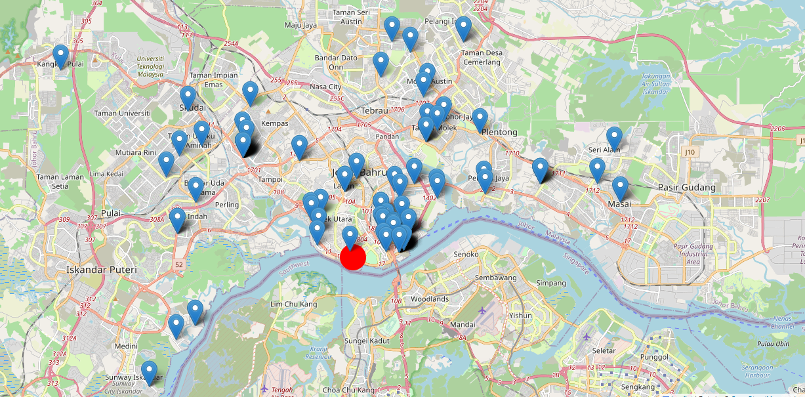
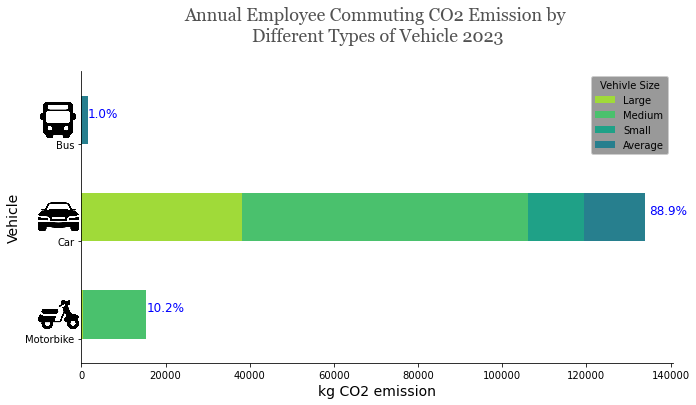

<!-- anchor tag for back-to-top links -->

<!-- TABLE OF CONTENTS -->
## Table of Contents
<ol>
  <li>
    <a href="#summary">Summary</a>
    <ul>
      <li><a href="#built-with">Built With</a></li>
    </ul>
  </li>
  <li>
    <a href="#motivation">Motivation</a>
  </li>
  <li>
    <a href="#data-collection">Data Collection</a>
  </li>
  <li>
    <a href="#data-manipulation">Data Manupulation</a>
  </li>
</ol>

<!-- SUMMARY -->
## Summary
+ **Motivation**: Streamlined the calculation of employees' commuting distances to the workplace and their corresponding Scope 3 CO2 emissions for the Sustainability Report. 
+ **Data collection**: Company should collect information from their own employees. However,a simulated list of addresses is used for this project due to data privacy.
+ **Data processing**: Generated distance data using the Google Maps API. Total kg CO2 emission per exployee were processed using pandas based on UK goverment emmission factor
+ **Data Visualization**: Visualized data shows location of company's employees and the total CO2 emission by type of vehicle used.

### Built With
* [![Python][Python-badge]][Python-url]
* [![NumPy][NumPy-badge]][NumPy-url]
* [![Pandas][Pandas-badge]][Pandas-url]
* [![Matplotlib][Matplotlib-badge]][Matplotlib-url]
* [![Jupyter Notebook][JupyterNotebook-badge]][JupyterNotebook-url]

<!-- MOTIVATION -->
## Motivation
+ **Problem**:Estimating CO2 emissions for employee commuting in Scope 3 Sustainability Reporting can be quite time-consuming, primarily because it involves laborious calculations of the distances between employees' locations and their workplaces.
+ **Project goal**: Implement automation for distance calculations utilizing the Google Maps API in Python to streamline and simplify the labor-intensive data processing tasks. The established automation process for distance-based method CO2 emission estimation will be then used in supply-chain CO2 emission estimation.

 

<!-- DATA COLLECTION -->
## Data Collection
+ In the simulated dataset, information on 180 property listings from an online real estate platform is collected to represent employee locations. 
+ The vehicle types were randomly assigned to these employees.

<!-- DATA MANUPULATION -->
## Data Manupulation
+ **Data generating**: Distance between employees location and workplace were generated automatically using Google Maps API in python. Annual total kg CO2 emission of employee commuting were estimated based on distance-based method in GHG protocol.

<!-- DATA Visualization -->
## Data Visualization
+ **Python data visualization**: Spreaded locations of company's employees and the total CO2 emission by type of vehicle used were shown using Python data visualization packages. Annual employee commuting emissions can be included in the scope3 CO2 emission for Sustainability Reporting.

 

(<a href="#readme-top">back to top</a>)

<!-- MARKDOWN LINKS -->
[Python-badge]: https://img.shields.io/badge/python-3670A0?style=for-the-badge&logo=python&logoColor=ffdd54
[Python-url]: https://www.python.org/
[NumPy-badge]: https://img.shields.io/badge/numpy-%23013243.svg?style=for-the-badge&logo=numpy&logoColor=white
[NumPy-url]: https://numpy.org/
[Pandas-badge]: https://img.shields.io/badge/pandas-%23150458.svg?style=for-the-badge&logo=pandas&logoColor=white
[Pandas-url]: https://pandas.pydata.org/
[Matplotlib-badge]: https://img.shields.io/badge/Matplotlib-%23ffffff.svg?style=for-the-badge&logo=Matplotlib&logoColor=black
[Matplotlib-url]: https://matplotlib.org/
[JupyterNotebook-badge]: https://img.shields.io/badge/jupyter-%23FA0F00.svg?style=for-the-badge&logo=jupyter&logoColor=white
[JupyterNotebook-url]: https://jupyter.org/
[PyCharm-badge]: https://img.shields.io/badge/pycharm-143?style=for-the-badge&logo=pycharm&logoColor=black&color=black&labelColor=green
[PyCharm-url]: https://www.jetbrains.com/pycharm/
